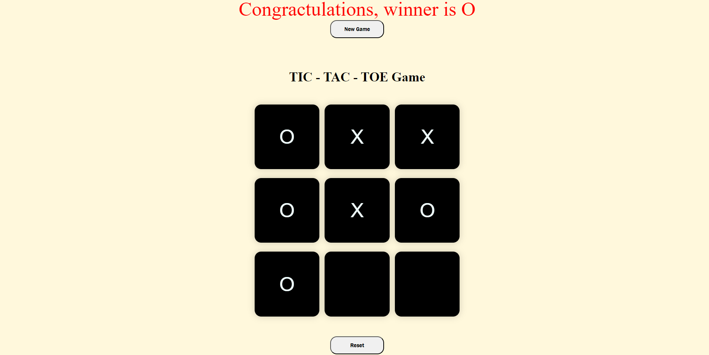

# Tic-Tac-Toe-game
a tic-tac-toe game can play two memners at a time. it is a small game that is developed using html,css and javascript.

-The game consists of two buttons
 -New Game button - a fresh start from here.
 -Reset button - it resets the whole game. and starts again.

after completetion of game it will show the winner from the top of the web page.

.

